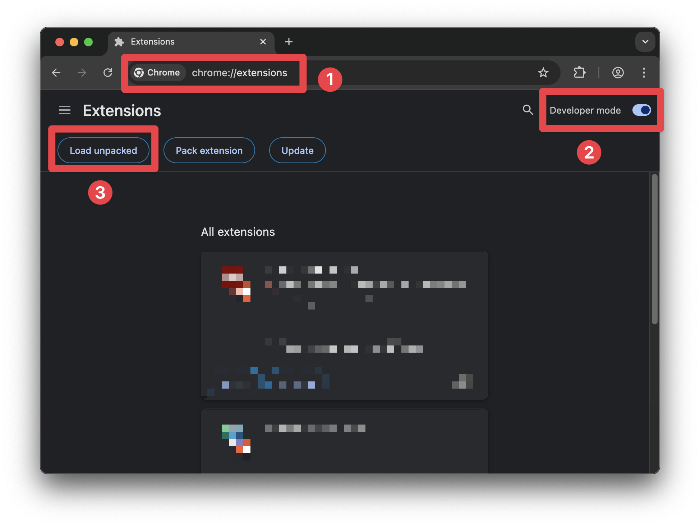
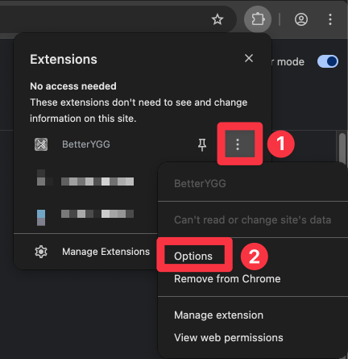
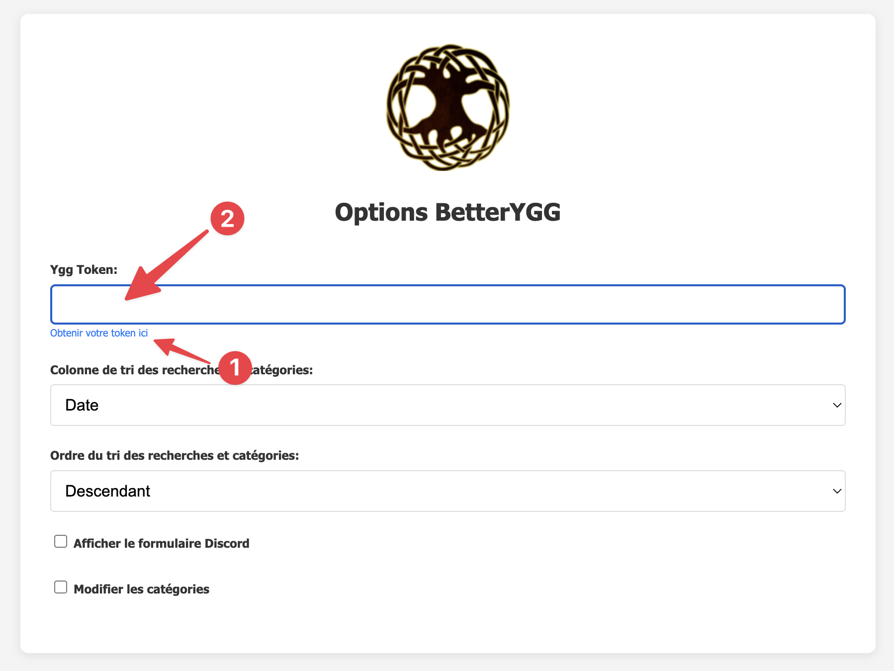

# BetterYGG
Chrome extension for the website yggtorrent.org

## Installation

1. Clonez le dépôt : `git clone https://github.com/NohamR/BetterYGG`
2. Ouvrez Chrome et allez à `chrome://extensions/`
3. Activez le mode développeur
4. Cliquez sur "Charger l'extension non empaquetée"
5. Sélectionnez le dossier du dépôt cloné

## Configuration importante

**N'oubliez pas d'entrer votre token YGG dans les options de l'extension !** Rendez-vous dans les options et ajoutez votre token disponible sur [votre compte YGG](https://www.yggtorrent.org/user/account).

Cette extension conçue pour le site yggtorrent.org permet de télécharger des torrents sans être authentifié. Pour cela rendez vous dans les options de l'extension et introduisez votre token Ygg. Ce token est disponible dans l'onglet mon compte du site.

Note: Cette extension utilise désormais yggapi.eu pour le téléchargement des torrents (API non officielle).

Grosse fonctionnalité supplémentaire:
Ajout d'un formulaire qui peut être soumis sur un channel discord, ajoutez le webhook de celui ci dans les options ainsi que le pseudo désiré. Le format du message soumis est le suivant: {"title":"titre","season":"numéro de saison","épisode":"numéro de l’épisode","id":"id du torrent","quality":"qualité","type":"nom de la catégorie"}
Les catégories ainsi que les urls reliées sont modifiable dans les options.

Ajustements mineurs: 

[1.0]
- Enlève la vidéo YouTube sur l'écran d’accueil
- Fixe la barre section sur la gauche pour qu'elle se ferme automatiquement en fonction de la taille de l'écran.
- Enlève la notification appelant à faire un don.

[1.1]
- Ajoute un bouton de Téléchargement dans le résultat de la recherche
- Trie la recherche par date par défaut

[1.2]
- Le tri et l'ordre des recherches est personnalisable dans les options
- Correction du tri par nbr de commentaire qui ne fonctionne pas de base...

[1.2.9]
- Mise à jour vers yggtorrent.org
- Utilisation de yggapi.eu pour le téléchargement des torrents

[1.3]
- Suppression des éléments promotionnels :
  - Élément "Compte Actif" avec lien donation
  - Message de limite de téléchargements quotidiens
  - Liens de promotion "Turbo"
  - Bannière "Bonus Go & Freeleech"
